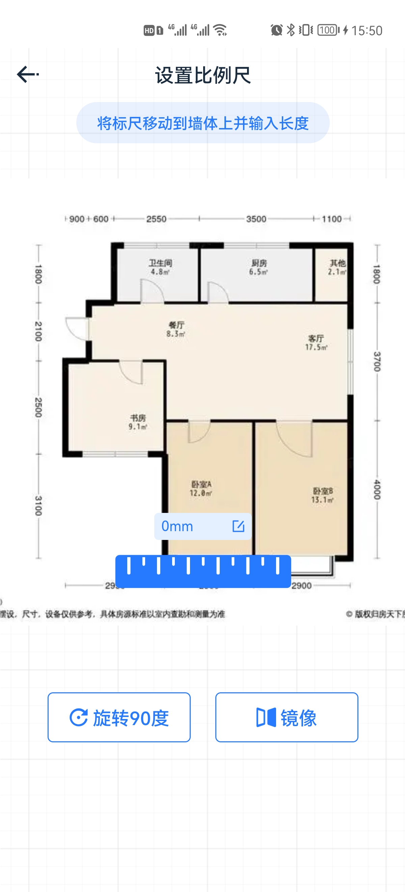
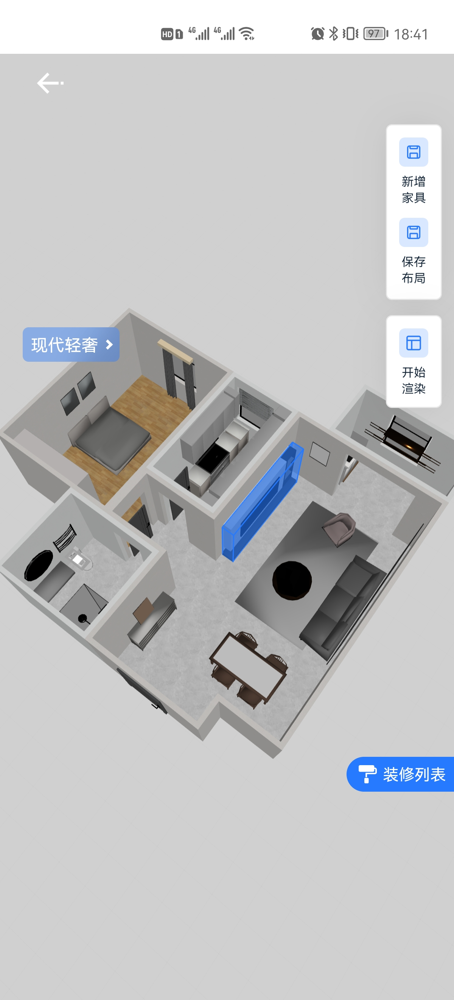

# 3DRender

#### 介绍
3DRender是一款家装营销软件，依靠AI布局、云端渲染技术优势，提供一键装修、一键换装、现场锁单、智能提取客户信息等功能，帮助装企营销拓客、助力现场谈单。OEM贴牌、源码购买、软件销售代理、技术培训；核心自主研发家装智能布局系统、分布式渲染农场、户型绘制工具等

## 项目介绍

1. 家具自动布局系统：自适应空间摆放，科学分类，碰撞检测、自动布局，毫秒级计算；

2. 分布式渲染系统：云端自动订阅渲染任务，官方精调渲染参数，也可以自定义指定，多视角渲染，全景图渲染；支持动态光源计算，可以按照经纬度及时间展现不同的光感，秒级极速高质量渲染；技术框架：（UE）虚幻4、blender、3dMax

3. 户型绘制工具：自研户型图绘制工具，基于中线、内墙绘制算法，支持斜墙绘制，房间导入；

4. 户型图识别：自研基于opencv的户型图智能识别系统，识别率达到93%，能准确获取绝大部分户型图的门、窗、墙、阳台、推拉门等数据，将整体户型图数据结构化；

5. 全景图VR展示系统：自研基于three.js的全景图VR展示系统，支持多场景切换、背景音乐；

官方网站：(https://www.huanjia3d.com)}

#### 承接业务

支持OEM贴牌定制运营；
支持全套源码购买；
支持独立系统拆分购买；
基于全套系统或者子系统的某项功能二开定制；

#### 软件演示、源码、贴牌、试用联系方式

1.  咨询v：wlgbzg
2.  咨询电话: 18515850233

#### 功能演示

